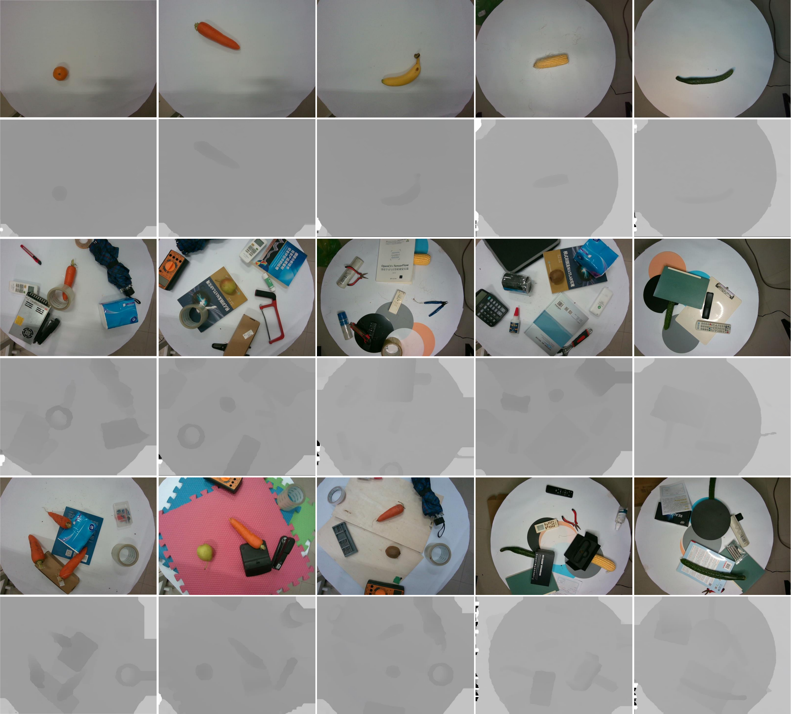
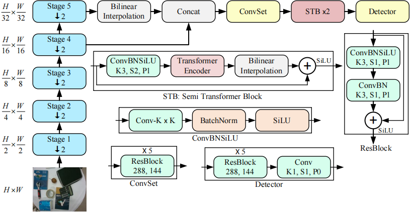
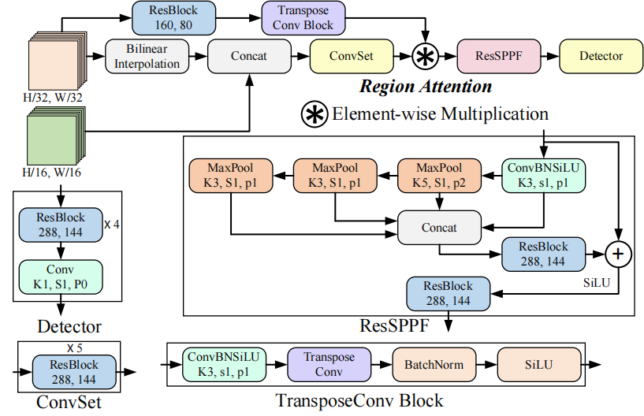
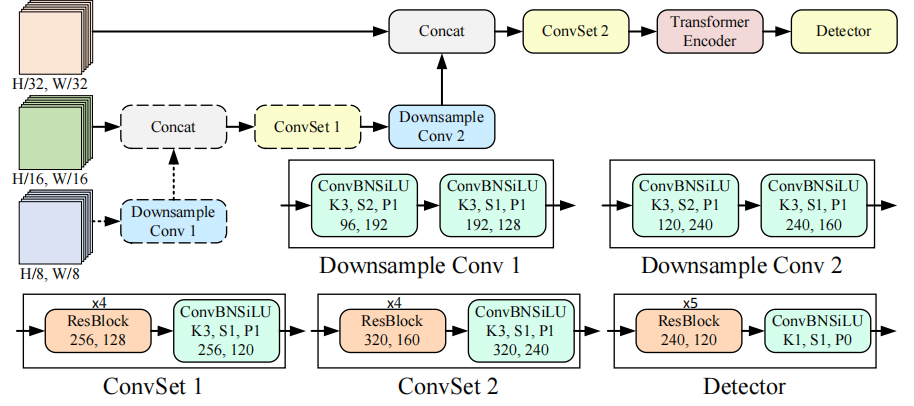
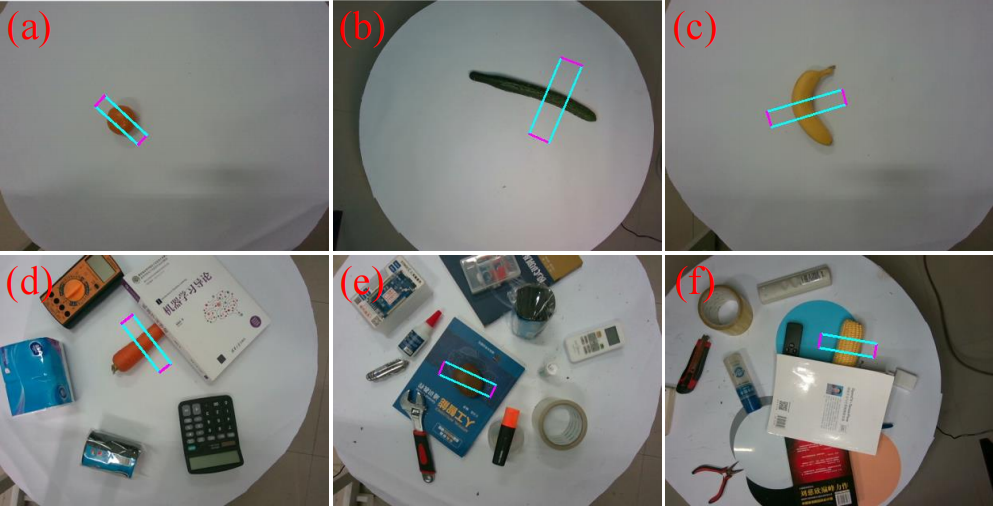

This is the repository for the **NBMOD** (Noisy Background Multi-Object Dataset for grasp detection) and the code of the paper ***NBMOD: Find It and Grasp It in Noisy Background***.

# Introduction
We propose a dataset called **NBMOD** (Noisy Background Multi-Object Dataset for grasp detection) consisting of **31,500 RGB-D images**, which is composed of three subsets: Simple background Single-object Subset (**SSS**), Noisy background Single-object Subset (**NSS**), and Multi-Object grasp detection Subset (**MOS**). Among them, the SSS subset consists of 13,500 images, the NSS subset consists of 13,000 images, and the MOS subset consists of 5,000 images.

Unlike the renowned Cornell dataset, the NBMOD dataset differs in that its backgrounds are no longer simple whiteboards. The NSS and MOS subsets comprise a substantial number of images with noise, where this noise corresponds to interfering objects unrelated to the target objects for grasping detection. Moreover, in the MOS subset, each image encompasses multiple target objects for grasp detection, which closely resembles real-world working environments.

To enhance the task of grasp detection, we propose a novel mechanism called **RAM** (Rotation Anchor Mechanism) and design three detection network architectures: **RARA** (network with Rotation Anchor and Region Attention), **RAST** (network with Rotation Anchor and Semi Transformer), and **RAGT** (network with Rotation Anchor and Global Transformer). These architectures aim to improve the accuracy and robustness of grasp detection by incorporating rotation anchor-based methods and attention mechanisms.

Some samples of NBMOD are shown in the following figure:

 

Annotations of some samples in NBMOD are illustrated in the following figure as examples:

 

# Model Architectures
The architectures of the RAST, RARA, and RAGT models are depicted in the following figures:

**RAST:**

 

**RARA:**

 

**RAGT:**

 

# Detection Results
Detection results on SSS and NSS:

 

Detection results on MOS:

 

# Download NBMOD and Model Weights
The NBMOD is available at [NBMOD](https://pan.baidu.com/s/1kHtTKYkqFciJpfiMkEENaQ), with the password for extraction being 6666.

The weights of models are available at [Weights](https://pan.baidu.com/s/18tAB5Yuu0yAJiyQvjE2vJw). The password for extraction is 6666.

# Citation
You can find a paper for explaining the NBMOD and our models on [arXiv](https://arxiv.org/abs/2306.10265).

If you use this library or find the documentation useful for your research, please consider citing:

    @article{cao2023nbmod,
      title={NBMOD: Find It and Grasp It in Noisy Background},
      author={Cao, Boyuan and Zhou, Xinyu and Guo, Congmin and Zhang, Baohua and Liu, Yuchen and Tan, Qianqiu},
      journal={arXiv preprint arXiv:2306.10265},
      year={2023}
    }
